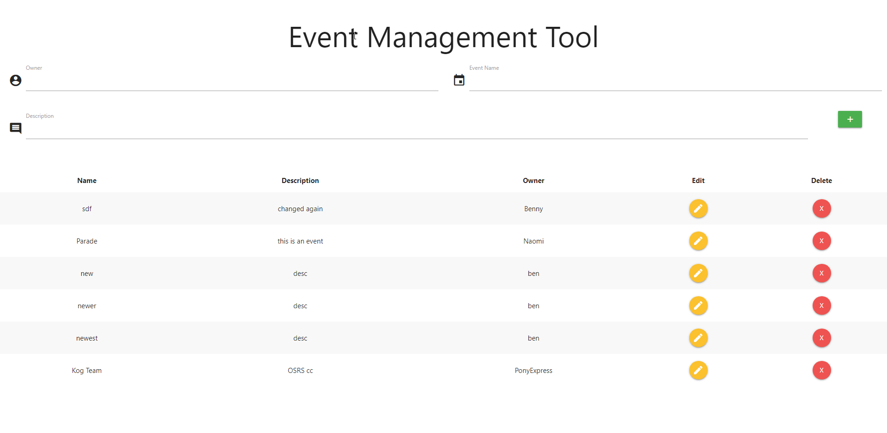
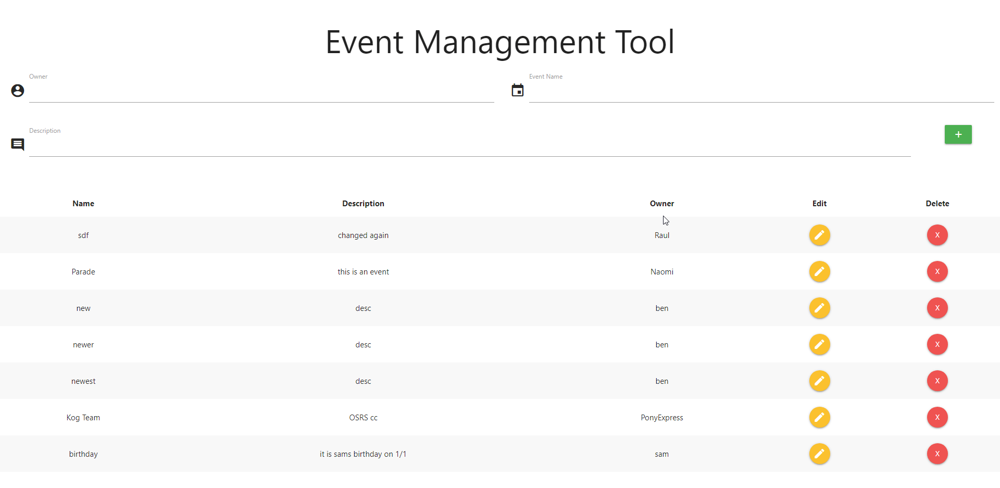

# Event Management Tool Front-End React

## Adding new records



## Updating existing record


## Deleting existing record



## Event Form for basic CRUD applications

## Installation

Use the package manager[npm] to install dependencies

```
npm i
npm start
```

## Features

Built with React, and styled with MaterializeCSS.

Auto populates data on edit. Saves on API calls by manually adding, updating, or removing, from current data stored.

Uses Axios for API calls to different endpoints.
